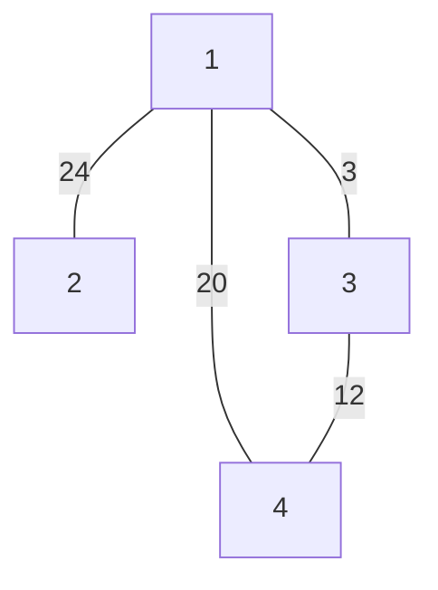
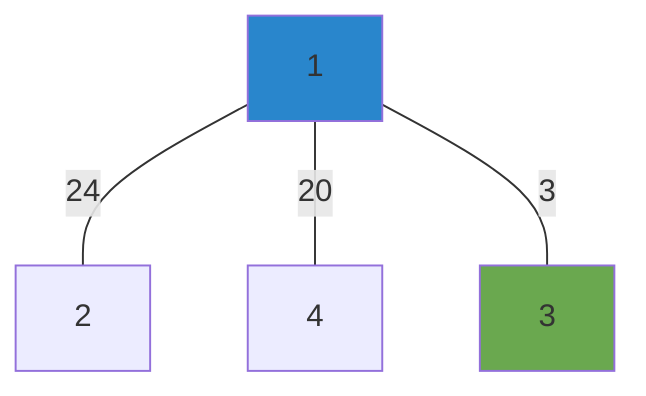
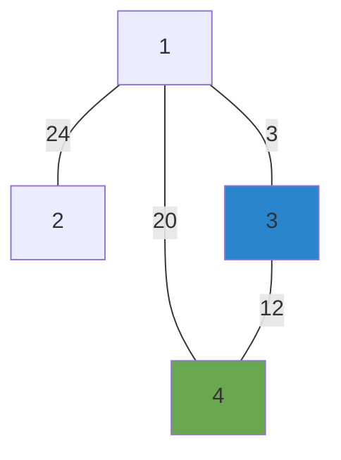

# dijkstra

## init

create `n` nodes
set distances all to `INT_MAX` (infinity)
set starting node distance to `0`
set all previous nodes to 0 or null

## explore

visit next unvisited node with shortest distance
- init start to 0, and it will always be first

for current vertex, examine its unvisited neighbors

- mark neighbors as visited
- if the newDistance < currentDistance update it
- update the previous node for all neighbors

pick the next node to visit with the lowest distance

## example

|vertex|distance|previous|
|------|--------|--------|
|1|0|0|
|2|infinite|0|
|3|infinite|0|
|4|infinite|0|



goto smallest distance: `node 1`

|vertex|distance|previous|
|------|--------|--------|
|1|0|1|
|2|24|1|
|3|3|1|
|4|20|1|



goto next smallest distance: `node 3`



check distances:

```
d3 = 3
d4 = 20
cost = 12  

d4 > (cost + d3) = `true`
d4 = cost + d3
```

|vertex|distance|previous|
|------|--------|--------|
|1|0|0|
|2|24|1|
|3|3|1|
|4|15|3|

add distances to result array and print to std::cout
