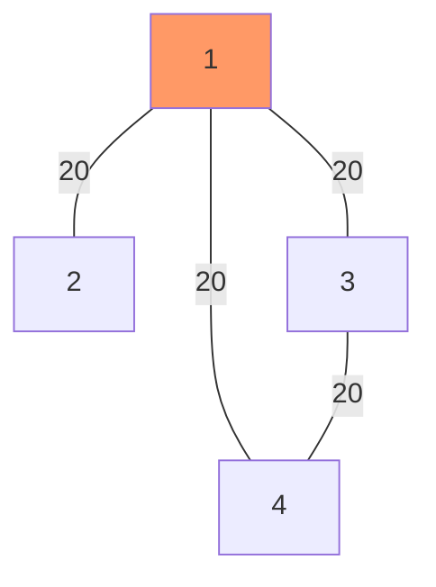

# dijkstra

## init

create `n` nodes
set distances all to `INT_MAX` (infinity)
set starting node distance to `0`
set all previous nodes to 0 or null

## explore

1. visit next unvisited node with shortest distance

- init start to 0, and it will always be first

2. for current vertex, examine its unvisited neighbors

- mark neighbors as visited
- if the newDistance < currentDistance update it
- update the previous node for all neighbors

3. pick the next node to visit with the lowest distance

